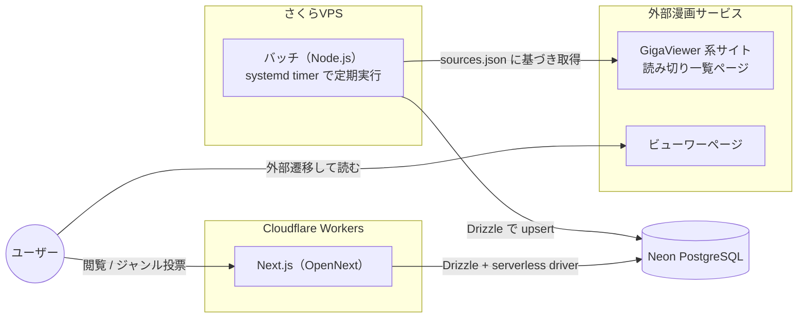

# 読み切り漫画データベース 仕様書

## 1. 概要

各漫画配信サービスに掲載されている「読み切り漫画」を横断的に収集し、
一覧を grid 形式で表示する Web サービス。

- 対象は GigaViewer 系漫画サービス（[はてな GigaViewer](https://hatena.co.jp/solutions/gigaviewer) を採用したサービス）のうち、
  [コミックDAYS の読切一覧](https://comic-days.com/oneshot) のような読み切り一覧ページを持つサービス
- 漫画本体は本サービスでは配信せず、各サービスのビューワーページへ外部遷移させる
- 読了後に戻ってきたユーザーへ「この読み切りはどんなジャンルだったか」を質問し、
  投票を集計して各漫画にジャンルバッジとして表示する

### スコープ

| 項目                     | 対象                      |
| ------------------------ | ------------------------- |
| 読み切り一覧の収集・表示 | ✅ 対象                   |
| 外部ビューワーへの遷移   | ✅ 対象                   |
| ジャンル投票・集計・表示 | ✅ 対象                   |
| 漫画本体の配信           | ❌ 対象外                 |
| ユーザー認証             | ❌ 対象外（匿名 ID のみ） |

## 2. 技術スタック

| レイヤ               | 技術                                 | 備考                                                      |
| -------------------- | ------------------------------------ | --------------------------------------------------------- |
| フロントエンド / BFF | Next.js（App Router）                | `@opennextjs/cloudflare` で Cloudflare Workers にデプロイ |
| ORM                  | Drizzle ORM                          | スキーマは web / batch で共有                             |
| データベース         | Neon（Serverless PostgreSQL）        | Workers からは `@neondatabase/serverless` ドライバで接続  |
| バッチサーバ         | さくらVPS 上の Node.js（TypeScript） | systemd timer で定期実行                                  |
| パッケージ管理       | pnpm workspace（monorepo）           |                                                           |

## 3. システム構成



処理の流れは次の通り。

1. バッチが `sources.json` に定義されたサービスの読み切り一覧ページへ定期アクセスし、読み切り情報を Neon に upsert する
2. Next.js（Workers）が Neon から一覧を取得し、grid で表示する
3. ユーザーが「読む」を押すと外部ビューワーページへ遷移する
4. 読了して戻ってきたユーザーにジャンル投票モーダルを表示し、投票結果を保存する
5. 得票数上位のジャンルを各漫画のバッジとして表示する

## 4. 対象サイト定義（sources.json）

クロール対象のサービスはリポジトリ直下の `sources.json` で宣言的に管理する。

GigaViewer で共通化されているのはビューワー・履歴ページの機構のみで、
トップページや作品一覧ページの HTML 構造は掲載元（出版社・レーベル）ごとに異なる。
そのため `sources.json` の `parser` 種別は「GigaViewer 採用サービス」を示す
`gigaviewer` の 1 種類のみだが、一覧ページの抽出ロジックはソースごとに実装する必要がある
（詳細は [003 バッチクローラー](./plans/003_バッチクローラー.md) を参照）。

```json
{
  "$schema": "./sources.schema.json",
  "sources": [
    {
      "key": "comic-days",
      "name": "コミックDAYS",
      "listUrl": "https://comic-days.com/oneshot",
      "parser": "gigaviewer",
      "enabled": true
    }
  ]
}
```

| フィールド | 型      | 説明                                                |
| ---------- | ------- | --------------------------------------------------- |
| `key`      | string  | サービスの一意なキー。DB の `source_key` に保存する |
| `name`     | string  | 表示用のサービス名                                  |
| `listUrl`  | string  | 読み切り一覧ページの URL                            |
| `parser`   | string  | 使用するパーサー種別。当面は `gigaviewer` のみ      |
| `enabled`  | boolean | `false` にするとクロール対象から除外する            |

サービスの追加は `sources` 配列へのエントリ追加のみで完結させる。

## 5. データモデル

Drizzle スキーマは `packages/db` に配置し、web / batch から共有する。

### 5.1 oneshots（読み切り漫画）

| カラム          | 型          | 制約     | 説明                                          |
| --------------- | ----------- | -------- | --------------------------------------------- |
| `id`            | serial      | PK       | 内部 ID                                       |
| `source_key`    | text        | not null | 掲載サービスのキー（`sources.json` の `key`） |
| `title`         | text        | not null | タイトル                                      |
| `author`        | text        |          | 作者名                                        |
| `thumbnail_url` | text        |          | サムネイル画像 URL                            |
| `viewer_url`    | text        | not null | ビューワーページ URL                          |
| `published_at`  | timestamptz |          | 掲載日時（取得できた場合）                    |
| `first_seen_at` | timestamptz | not null | バッチが初めて検出した日時                    |
| `last_seen_at`  | timestamptz | not null | バッチが最後に確認した日時                    |

- unique 制約: `(source_key, viewer_url)`。バッチはこのキーで upsert する
- 一覧から消えた作品は削除せず、`last_seen_at` が更新されなくなるだけとする

### 5.2 genres（ジャンルマスタ）

| カラム       | 型      | 制約             | 説明                     |
| ------------ | ------- | ---------------- | ------------------------ |
| `id`         | serial  | PK               | 内部 ID                  |
| `key`        | text    | unique, not null | 英字キー（例: `battle`） |
| `label`      | text    | not null         | 表示名（例: バトル）     |
| `sort_order` | integer | not null         | 投票モーダルでの表示順   |

固定リストとして seed する。初期ジャンル案は次の通り。

バトル / 恋愛 / コメディ・ギャグ / ホラー / SF / ファンタジー /
ミステリー・サスペンス / 日常 / スポーツ / ヒューマンドラマ

### 5.3 genre_votes（ジャンル投票）

| カラム              | 型          | 制約                       | 説明               |
| ------------------- | ----------- | -------------------------- | ------------------ |
| `id`                | serial      | PK                         | 内部 ID            |
| `oneshot_id`        | integer     | FK → oneshots.id, not null | 対象の読み切り     |
| `genre_id`          | integer     | FK → genres.id, not null   | 投票されたジャンル |
| `anonymous_user_id` | uuid        | not null                   | 匿名ユーザー ID    |
| `created_at`        | timestamptz | not null                   | 投票日時           |

- unique 制約: `(oneshot_id, genre_id, anonymous_user_id)`。同一ユーザーの重複投票を防ぐ
- 1 ユーザーは 1 作品に対して複数ジャンルへ投票できる（複数選択可）

## 6. 画面仕様

### 6.1 トップページ（読み切り一覧）

- 読み切り漫画をカード形式の grid で表示する
- 各カードの表示要素
  - サムネイル画像
  - タイトル
  - 作者名
  - 掲載サービス名（例: コミックDAYS）
  - ジャンルバッジ（得票数上位 3 件、投票が無い場合は非表示）
- ソート: 掲載日時（`published_at`、無い場合は `first_seen_at`）の新着順
- フィルタ: ジャンルによる絞り込み
- カードのクリック（「読む」）で外部ビューワーページを新規タブで開く

### 6.2 ジャンル投票モーダル

- 読了して戻ってきたと判定されたタイミングで表示する（判定は「7. 読了検知・投票フロー」参照）
- 表示要素
  - 対象作品のサムネイル・タイトル
  - 「この読み切りはどんなジャンルでしたか？」という質問文
  - 固定ジャンルリストのチップ（複数選択可）
  - 「投票する」「スキップ」ボタン
- スキップした作品には再度モーダルを出さない（localStorage に記録）

## 7. 読了検知・投票フロー

外部サイトへ遷移するため正確な読了は検知できない。
「外部遷移してから一定時間後に戻ってきた」ことを読了とみなすヒューリスティックを採用する。

### 7.1 匿名ユーザー ID

- 初回アクセス時に `crypto.randomUUID()` で UUID を生成し、localStorage に保存する
- 投票 API の呼び出し時にこの ID を送信し、重複投票の抑止に使う
- ブラウザが変われば別ユーザーとして扱われることは許容する

### 7.2 読了判定

1. 「読む」クリック時に localStorage へ `{ oneshotId, clickedAt }` を保存し、外部ビューワーを新規タブで開く
2. 元タブへの復帰（`visibilitychange` で visible になったとき）または再訪問時に、保存した記録を確認する
3. `clickedAt` から **60 秒以上** 経過していれば読了とみなし、ジャンル投票モーダルを表示する
4. 60 秒未満（すぐ戻ってきた）の場合は読了とみなさず、記録を破棄する
5. 投票済み・スキップ済みの作品は localStorage に記録し、再表示しない

### 7.3 ジャンル集計・表示

- 表示ジャンル = 作品ごとの得票数上位 3 件
- 同数の場合は `genre_id` の昇順（＝ジャンルマスタの登録順）でタイブレークする
- 集計は一覧取得クエリで `genre_votes` を `GROUP BY` 集計し、
  ページ自体を ISR（例: `revalidate: 300`）でキャッシュすることで負荷を抑える
- 将来的に投票数が増えた場合は、集計結果のマテリアライズ（集計テーブル化）を検討する

## 8. バッチ仕様

### 8.1 実行環境

- さくらVPS 上で Node.js（TypeScript）製バッチを systemd timer により **6 時間ごと** に実行する
- Neon へは通常の PostgreSQL 接続（`postgres` ドライバ）で接続する

### 8.2 処理フロー

1. `sources.json` を読み込み、`enabled: true` のソースを対象とする
2. 各ソースの `listUrl` に HTTP GET でアクセスする
3. `parser` に対応するパーサー（`gigaviewer`）で HTML をパースし、
   タイトル・作者・サムネイル URL・ビューワー URL・掲載日時を抽出する
   （一覧ページの構造はソースごとに異なるため、抽出処理は `source.key` 単位で実装する）
4. `(source_key, viewer_url)` をキーに `oneshots` へ upsert する
   - 新規: `first_seen_at` と `last_seen_at` に現在時刻を設定
   - 既存: メタデータと `last_seen_at` を更新
5. ソース単位でエラーをハンドリングし、1 ソースの失敗が他ソースへ波及しないようにする
6. 実行結果（取得件数・新規件数・エラー）をログに出力する

### 8.3 クロールマナー

- `robots.txt` を確認し、拒否されているパスへはアクセスしない
- User-Agent に本サービス名と連絡先を明示する
- リクエスト間隔を空ける（1 リクエスト / 秒以上）
- 取得するのは読み切り一覧ページのみとし、漫画本体（画像データ）は取得しない
- 各サービスの利用規約を確認し、問題がある場合は `enabled: false` で除外する

## 9. API 仕様

一覧表示は Next.js の Server Component で直接 DB を参照するため、
公開 API は投票エンドポイントのみとする。

### POST /api/oneshots/[id]/votes

ジャンル投票を登録する。

リクエストボディ:

```json
{
  "anonymousUserId": "550e8400-e29b-41d4-a716-446655440000",
  "genreIds": [1, 3]
}
```

レスポンス:

| ステータス        | 条件                                             |
| ----------------- | ------------------------------------------------ |
| `201 Created`     | 投票を登録した（重複分は無視して成功扱い）       |
| `400 Bad Request` | ボディ不正（UUID 形式エラー、genreIds が空など） |
| `404 Not Found`   | 対象の読み切りが存在しない                       |

- 重複投票は unique 制約違反を `ON CONFLICT DO NOTHING` で吸収する
- 簡易的な rate limit（同一 IP からの連続投稿制限）を Workers 側で検討する

## 10. リポジトリ構成

pnpm workspace による monorepo 構成とする。

```text
yomikiri-manga-database/
├── apps/
│   ├── web/          # Next.js（Cloudflare Workers + OpenNext）
│   └── batch/        # バッチ（さくらVPS で実行）
├── packages/
│   └── db/           # Drizzle スキーマ・マイグレーション（web / batch で共有）
├── docs/
│   └── 001_plan.md   # 本仕様書
├── sources.json      # クロール対象サービス定義
├── package.json
└── pnpm-workspace.yaml
```

## 11. 非機能要件・留意事項

- **DB 接続**: Workers からは `@neondatabase/serverless`（HTTP/WebSocket）、
  VPS からは通常の TCP 接続と、環境ごとにドライバを使い分ける
- **キャッシュ**: トップページは ISR でキャッシュし、Neon への負荷とレイテンシを抑える
- **秘匿情報**: DB 接続文字列は Workers では `wrangler secret`、VPS では環境変数で管理する
- **画像**: サムネイルは外部 URL を直接参照する（ホットリンク）。
  各サービス側で禁止されている場合はプレースホルダー表示に切り替える
- **法的配慮**: 収集するのはタイトル等の事実情報とリンクのみとし、
  漫画本文・画像データの複製は行わない

## 12. 今後の拡張（スコープ外）

- ユーザー認証と投票履歴の引き継ぎ
- ジャンルに基づくレコメンド
- GigaViewer 以外のサービスへの対応（パーサー種別の追加）
- 読了数・投票数などの統計ダッシュボード
