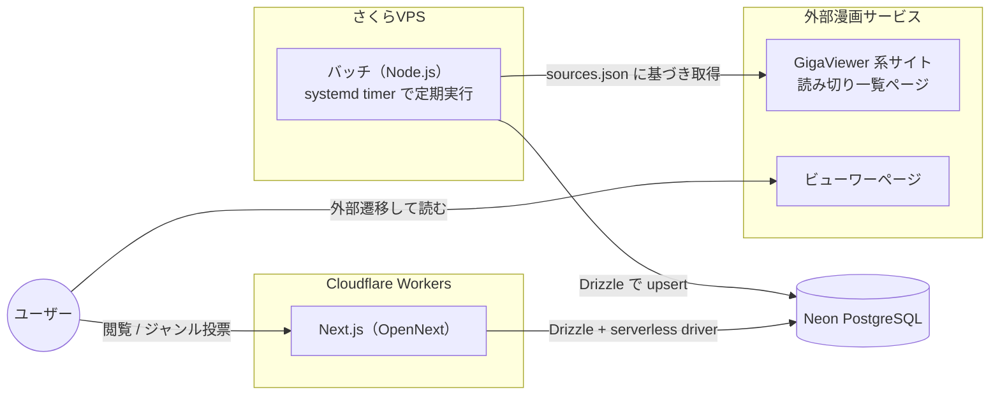

# 読み切り漫画データベース 仕様書

## 1. 概要

各漫画配信サービスに掲載されている「読み切り漫画」を横断的に収集し、
一覧を grid 形式で表示する Web サービス。

- 対象は GigaViewer 系漫画サービス（[はてな GigaViewer](https://hatena.co.jp/solutions/gigaviewer) を採用したサービス）のうち、
  [コミックDAYS の読切一覧](https://comic-days.com/oneshot) のような読み切り一覧ページを持つサービス
- 漫画本体は本サービスでは配信せず、各サービスのビューワーページへ外部遷移させる
- 読了後に戻ってきたユーザーへ「この読み切りはどんなジャンルだったか」を質問し、
  投票を集計して各漫画にジャンルバッジとして表示する

### スコープ

| 項目                     | 対象                      |
| ------------------------ | ------------------------- |
| 読み切り一覧の収集・表示 | ✅ 対象                   |
| 外部ビューワーへの遷移   | ✅ 対象                   |
| ジャンル投票・集計・表示 | ✅ 対象                   |
| 漫画本体の配信           | ❌ 対象外                 |
| ユーザー認証             | ❌ 対象外（匿名 ID のみ） |

## 2. 技術スタック

| レイヤ               | 技術                                 | 備考                                                      |
| -------------------- | ------------------------------------ | --------------------------------------------------------- |
| フロントエンド / BFF | Next.js（App Router）                | `@opennextjs/cloudflare` で Cloudflare Workers にデプロイ |
| ORM                  | Drizzle ORM                          | スキーマは web / batch で共有                             |
| データベース         | Neon（Serverless PostgreSQL）        | Workers からは `@neondatabase/serverless` ドライバで接続  |
| バッチサーバ         | さくらVPS 上の Node.js（TypeScript） | systemd timer で定期実行                                  |
| パッケージ管理       | pnpm workspace（monorepo）           |                                                           |
| ローカル開発環境     | Docker Compose                       | db / web / batch をすべてコンテナで起動（12 章）          |
| CI                   | GitHub Actions                       | lint / typecheck / test / build を検証（13 章）           |

## 3. システム構成



処理の流れは次の通り。

1. バッチが `sources.json` に定義されたサービスの読み切り一覧ページへ定期アクセスし、読み切り情報を Neon に upsert する
2. Next.js（Workers）が Neon から一覧を取得し、grid で表示する
3. ユーザーが「読む」を押すと外部ビューワーページへ遷移する
4. 読了して戻ってきたユーザーにジャンル投票モーダルを表示し、投票結果を保存する
5. 得票数上位のジャンルを各漫画のバッジとして表示する

## 4. 対象サイト定義（sources.json）

クロール対象のサービスはリポジトリ直下の `sources.json` で宣言的に管理する。

GigaViewer で共通化されているのはビューワー・履歴ページの機構のみで、
トップページや作品一覧ページの HTML 構造は掲載元（出版社・レーベル）ごとに異なる。
そのため `sources.json` の `parser` 種別は「GigaViewer 採用サービス」を示す
`gigaviewer` の 1 種類のみだが、一覧ページの抽出ロジックはソースごとに実装する必要がある
（詳細は [003 バッチクローラー](./plans/003_バッチクローラー.md) を参照）。

```json
{
  "$schema": "./sources.schema.json",
  "sources": [
    {
      "key": "comic-days",
      "name": "コミックDAYS",
      "listUrls": ["https://comic-days.com/oneshot", "https://comic-days.com/newcomer"],
      "siteUrl": "https://comic-days.com/",
      "parser": "gigaviewer",
      "enabled": true,
      "favicon": "/favicons/comic-days.png"
    }
  ]
}
```

| フィールド          | 型      | 説明                                                                                     |
| ------------------- | ------- | ----------------------------------------------------------------------------------------- |
| `key`                | string  | サービスの一意なキー。DB の `source_key` に保存する                                     |
| `name`               | string  | 表示用のサービス名                                                                       |
| `listUrls`           | array   | 同じ `parser`・同じ `source.key` で解析する読み切り一覧ページ URL の配列（1 件以上）    |
| `siteUrl`            | string  | サービスのトップページ URL。詳細取得バッチでの robots.txt 取得元（`/about` ページ等の紹介リンクにも使用）。一覧ページの robots.txt は `listUrls` の各 URL ごとに個別取得する |
| `parser`             | string  | 使用するパーサー種別。当面は `gigaviewer` のみ                                           |
| `enabled`            | boolean | `false` にするとクロール対象から除外する                                                 |
| `favicon`            | string  | `apps/web/public/favicons/` 以下に配置した favicon 画像への絶対パス。一覧カードに表示する |
| `fallbackSourceKey`  | string（任意） | 姉妹サイト等で同一作品が重複掲載される場合に指定する。指定した source に既に同一パス（クエリ除く）の viewer URL が登録済みなら、このソースでの登録をスキップする |

サービスの追加は `sources` 配列へのエントリ追加のみで完結させる。

## 5. データモデル

Drizzle スキーマは `packages/db` に配置し、web / batch から共有する。

### 5.1 oneshots（読み切り漫画）

| カラム               | 型          | 制約     | 説明                                                                                         |
| --------------------- | ----------- | -------- | --------------------------------------------------------------------------------------------- |
| `id`                  | serial      | PK       | 内部 ID                                                                                       |
| `source_key`          | text        | not null | 掲載サービスのキー（`sources.json` の `key`）                                                 |
| `title`               | text        |          | タイトル（ビューワーページから取得。詳細取得前は `null`）                                     |
| `author`              | text        |          | 作者名（ビューワーページから取得）                                                             |
| `thumbnail_url`       | text        |          | サムネイル画像 URL（ビューワーページから取得）                                                 |
| `viewer_url`          | text        | not null | ビューワーページ URL                                                                          |
| `published_at`        | timestamptz |          | 掲載日時（ビューワーページのエピソード公開日から取得）                                        |
| `year`                | integer     |          | `published_at` の年（年別表示用）                                                              |
| `details_fetched_at`  | timestamptz |          | 詳細取得バッチが最後にビューワーページへアクセスした日時。`null` は詳細未取得（詳細取得バッチのキュー対象） |
| `first_seen_at`       | timestamptz | not null | バッチが初めて検出した日時                                                                    |
| `last_seen_at`        | timestamptz | not null | バッチが最後に確認した日時                                                                    |

- unique 制約: `(source_key, viewer_url)`。URL 収集バッチはこのキーで upsert する
- 一覧から消えた作品は削除せず、`last_seen_at` が更新されなくなるだけとする
- Web の一覧表示は `title IS NOT NULL`（＝詳細取得済み）の行のみを対象とする

### 5.2 genres（ジャンルマスタ）

| カラム       | 型      | 制約             | 説明                     |
| ------------ | ------- | ---------------- | ------------------------ |
| `id`         | serial  | PK               | 内部 ID                  |
| `key`        | text    | unique, not null | 英字キー（例: `battle`） |
| `label`      | text    | not null         | 表示名（例: バトル）     |
| `sort_order` | integer | not null         | 投票モーダルでの表示順   |

固定リストとして seed する。ジャンル一覧は次の通り。

バトル / 恋愛 / コメディ・ギャグ / ホラー / SF / ファンタジー /
ミステリー・サスペンス / 日常 / スポーツ / ヒューマンドラマ / グルメ / NSFW

### 5.3 genre_votes（ジャンル投票）

| カラム              | 型          | 制約                       | 説明               |
| ------------------- | ----------- | -------------------------- | ------------------ |
| `id`                | serial      | PK                         | 内部 ID            |
| `oneshot_id`        | integer     | FK → oneshots.id, not null | 対象の読み切り     |
| `genre_id`          | integer     | FK → genres.id, not null   | 投票されたジャンル |
| `anonymous_user_id` | uuid        | not null                   | 匿名ユーザー ID    |
| `created_at`        | timestamptz | not null                   | 投票日時           |

- unique 制約: `(oneshot_id, genre_id, anonymous_user_id)`。同一ユーザーの重複投票を防ぐ
- 1 ユーザーは 1 作品に対して複数ジャンルへ投票できる（複数選択可）

## 6. 画面仕様

### 6.1 トップページ（読み切り一覧）

- 読み切り漫画をカード形式の grid で表示する
- 各カードの表示要素
  - サムネイル画像
  - タイトル
  - 作者名
  - 掲載サービス名（例: コミックDAYS、ファビコン付き）
  - ジャンルバッジ（得票数上位 3 件、投票が無い場合は非表示）
  - お気に入りボタン（トグル式。状態は localStorage で管理し「6.3 お気に入り一覧ページ」に反映する）
- 既読（読了検知済み）の作品はカードの見た目を変えて区別する
- ソート: 掲載日時（`published_at`）の新しい順。同着の場合はタイトルの昇順。
  `published_at` が未取得の作品は末尾に表示する
- フィルタ: ジャンルによる絞り込み
- カードのクリック（「読む」）で外部ビューワーページを新規タブで開く

### 6.2 ジャンル投票モーダル

- 読了して戻ってきたと判定されたタイミングで表示する（判定は「7. 読了検知・投票フロー」参照）
- 表示要素
  - 対象作品のサムネイル・タイトル
  - 「この読み切りはどんなジャンルでしたか？」という質問文
  - 固定ジャンルリストのチップ（複数選択可）
  - 「投票する」「スキップ」ボタン
- スキップした作品には再度モーダルを出さない（localStorage に記録）

### 6.3 お気に入り一覧ページ

- トップページのカードでお気に入り登録した作品のみを一覧表示する専用ページ（`/favorites`）
- 表示順はお気に入り登録順（最近登録した作品が先頭）
- 登録済み作品が無い場合は空状態表示を出す
- お気に入り状態はサーバーに保存せず、localStorage（匿名・端末ローカル）のみで管理する

### 6.4 プライバシーポリシーページ

- アクセス解析（Google Analytics）における Cookie の利用や、閲覧履歴を端末内のみで管理している旨を
  説明する専用ページ（`/privacy`）
- footer に導線を設置し、全ページからアクセスできるようにする

## 7. 読了検知・投票フロー

外部サイトへ遷移するため正確な読了は検知できない。
「外部遷移してから一定時間後に戻ってきた」ことを読了とみなすヒューリスティックを採用する。

### 7.1 匿名ユーザー ID

- 初回アクセス時に `crypto.randomUUID()` で UUID を生成し、localStorage に保存する
- 投票 API の呼び出し時にこの ID を送信し、重複投票の抑止に使う
- ブラウザが変われば別ユーザーとして扱われることは許容する

### 7.2 読了判定

1. 「読む」クリック時に localStorage へ `{ oneshotId, clickedAt }` を保存し、外部ビューワーを新規タブで開く
2. 元タブへの復帰（`visibilitychange` で visible になったとき）または再訪問時に、保存した記録を確認する
3. `clickedAt` から **10 秒以上** 経過していれば読了とみなし、ジャンル投票モーダルを表示する
4. 10 秒未満（すぐ戻ってきた）の場合は読了とみなさず、記録を破棄する
5. 投票済み・スキップ済みの作品は localStorage に記録し、再表示しない
6. 読了とみなした作品は既読として localStorage に記録し、トップページのカード表示に反映する

### 7.3 ジャンル集計・表示

- 表示ジャンル = 作品ごとの得票数上位 3 件
- 同数の場合は `genre_id` の昇順（＝ジャンルマスタの登録順）でタイブレークする
- 集計は一覧取得クエリで `genre_votes` を `GROUP BY` 集計し、
  ページ自体を ISR（例: `revalidate: 300`）でキャッシュすることで負荷を抑える
- 将来的に投票数が増えた場合は、集計結果のマテリアライズ（集計テーブル化）を検討する

## 8. バッチ仕様

バッチは「URL 収集」「詳細取得」の 2 段に分かれる。URL 収集を毎回全ソース完走させてから
詳細取得（キュー処理）を行うことで、詳細取得に時間がかかっても新規作品の発見自体は
毎回全ソースで滞りなく行われるようにする（1 サービスだけ処理が偏り続けることを防ぐ）。

### 8.1 実行環境

- さくらVPS 上で Node.js（TypeScript）製バッチを Docker コンテナ化し、systemd timer により
  **毎日 00:05・12:05・18:05（JST）** に起動・実行する（コンテナは実行のたびに起動・破棄する oneshot 運用とし、常駐はさせない）
- Neon へは通常の PostgreSQL 接続（`postgres` ドライバ）で接続する
- 1 回の実行で「8.2 URL 収集バッチ」→「8.3 詳細取得バッチ」を順に実行する

### 8.2 URL 収集バッチ

各サイトの読み切り一覧ページからビューワー URL を集め、`oneshots` へ登録する。

1. `sources.json` を読み込み、`enabled: true` のソースを対象とする
2. 各ソースの `listUrls` に列挙された URL それぞれに HTTP GET でアクセスする
3. `parser` に対応するパーサー（`gigaviewer`）で HTML をパースし、ビューワー URL を抽出する
   （一覧ページの構造・連載作品との混在有無はソースごとに異なるため、
   対象要素の絞り込みは `source.key` 単位で実装する）
4. `(source_key, viewer_url)` をキーに `oneshots` へ upsert する
   - 新規: `first_seen_at` / `last_seen_at` に現在時刻を設定し、詳細情報は未設定のままとする
     （`title` 等は `null`、`details_fetched_at` も `null`。詳細取得バッチのキュー対象になる）
   - 既存: `last_seen_at` のみ更新する（詳細情報は上書きしない）
5. ソース単位でエラーをハンドリングし、1 ソースの失敗が他ソースへ波及しないようにする
6. 実行結果（取得件数・新規件数・エラー）をログに出力する

### 8.3 詳細取得バッチ

GigaViewer はビューワーページのデザインが全サービス共通であることを利用し、
ビューワーページから直接タイトル・作者・サムネイル・掲載日を取得する。

1. `oneshots` から `details_fetched_at IS NULL`（詳細未取得）の行を取得し、キューとする
2. キューを `source_key` ごとにグルーピングし、**ラウンドロビン**で 1 件ずつ処理する
   （1 ソースの滞留件数が多い場合でも、他ソースの処理が後回しにならないようにするため）
3. 各ビューワー URL の HTML から次のセレクタで詳細を抽出する

   | 項目       | セレクタ                   | 備考                                           |
   | ---------- | --------------------------- | ----------------------------------------------- |
   | タイトル   | `.series-header-title`      |                                                  |
   | 作者       | `.series-header-author`     | 内部に `<a>` を含む場合はテキストのみ取得       |
   | サムネイル | `img.series-header-image`   |                                                  |
   | 掲載日     | `.episode-header-date`      | `published_at` に日付として格納し、年を `year` にも保存 |

4. 取得結果を `oneshots` に反映する
   - 抽出成功: `title` / `author` / `thumbnail_url` / `published_at` / `year` /
     `details_fetched_at`（現在時刻）を更新
   - 抽出失敗（タイトルが取得できない等）: `details_fetched_at` のみ更新し、
     無限リトライを防ぐ（表示対象からは `title IS NULL` のまま除外され続ける）
   - HTTP エラー・ネットワークエラー: `details_fetched_at` を更新せず、
     次回バッチでの再試行対象として残す
5. 実行結果（試行件数・取得件数・失敗件数・エラー）をソース単位でログに出力する

### 8.4 クロールマナー

- `robots.txt` を確認し、拒否されているパスへはアクセスしない（一覧ページ・ビューワーページ共通）
- User-Agent に本サービス名と連絡先を明示する
- リクエスト間隔はサービス（`source_key`）ごとに **1 リクエスト / 秒以上** 空ける
  （URL 収集・詳細取得のいずれも同じ制約を守る）
- 取得するのは読み切り一覧ページ・ビューワーページの HTML のみとし、漫画本体（画像データ）は取得しない
- 各サービスの利用規約を確認し、問題がある場合は `enabled: false` で除外する

## 9. API 仕様

一覧表示は Next.js の Server Component で直接 DB を参照するため、
公開 API は投票エンドポイントのみとする。

### POST /api/oneshots/[id]/votes

ジャンル投票を登録する。

リクエストボディ:

```json
{
  "anonymousUserId": "550e8400-e29b-41d4-a716-446655440000",
  "genreIds": [1, 3]
}
```

レスポンス:

| ステータス                  | 条件                                             |
| --------------------------- | ------------------------------------------------ |
| `201 Created`               | 投票を登録した（重複分は無視して成功扱い）       |
| `400 Bad Request`           | ボディ不正（UUID 形式エラー、genreIds が空など） |
| `404 Not Found`             | 対象の読み切りが存在しない                       |
| `429 Too Many Requests`     | 同一 IP からの連続投稿によるレート制限超過       |

- 重複投票は unique 制約違反を `ON CONFLICT DO NOTHING` で吸収する
- 簡易的な rate limit（同一 IP からの連続投稿制限）を Workers 側で実装する
  （IP は `cf-connecting-ip` ヘッダーから取得する）

## 10. リポジトリ構成

pnpm workspace による monorepo 構成とする。

```text
yomikiri-manga-database/
├── .github/
│   └── workflows/
│       └── ci.yml    # CI（13 章）
├── apps/
│   ├── web/          # Next.js（Cloudflare Workers + OpenNext）
│   └── batch/        # バッチ（さくらVPS で実行）
├── packages/
│   └── db/           # Drizzle スキーマ・マイグレーション（web / batch で共有）
├── docs/
│   ├── 001_plan.md   # 本仕様書
│   ├── 002_design.md # デザインドキュメント
│   └── plans/        # 機能ごとの実装計画
├── compose.yaml      # ローカル開発環境（12 章）
├── sources.json      # クロール対象サービス定義
├── package.json
└── pnpm-workspace.yaml
```

## 11. 非機能要件・留意事項

- **DB 接続**: Workers からは `@neondatabase/serverless`（HTTP/WebSocket）、
  VPS からは通常の TCP 接続と、環境ごとにドライバを使い分ける
- **キャッシュ**: トップページは ISR でキャッシュし、Neon への負荷とレイテンシを抑える
- **秘匿情報**: DB 接続文字列は Workers では `wrangler secret`、VPS では環境ファイル
  （`EnvironmentFile=`、パーミッション 600）で管理する
- **監視**: VPS 上のバッチは Mackerel（`mackerel-agent`）で死活監視する。実行成否を即時検知するチェックと、
  実行漏れ・ハングを検知する鮮度チェック（最終成功時刻の監視）を組み合わせる
- **画像**: サムネイルは外部 URL を直接参照する（ホットリンク）。
  各サービス側で禁止されている場合はプレースホルダー表示に切り替える
- **法的配慮**: 収集するのはタイトル等の事実情報とリンクのみとし、
  漫画本文・画像データの複製は行わない
- **アクセス解析**: Google Analytics（GA4）をサービス改善目的で利用する。トラッキングコードの読み込みは
  ビルド時環境変数 `NEXT_PUBLIC_GA_MEASUREMENT_ID` の設定有無で切り替え（未設定時は読み込まない）、
  利用について「6.4 プライバシーポリシーページ」に明記する

## 12. ローカル開発環境

ローカル環境は Docker Compose で起動する。Neon は本番専用とし、
ローカルの DB には PostgreSQL コンテナを使用する。

| サービス  | 内容                                                          | 起動方法                        |
| --------- | ------------------------------------------------------------- | -------------------------------- |
| `db`      | PostgreSQL。named volume でデータを永続化                     | `docker compose up`             |
| `web`     | Next.js 開発サーバ（ポート 3000）                              | `docker compose up`             |
| `wsproxy` | `web` が使う `@neondatabase/serverless`（WebSocket）を `db` への通常 TCP 接続へ変換する中継 | `docker compose up`（`web` の起動に伴い自動起動） |
| `batch`   | バッチの手動実行用（one-shot）                                 | `docker compose run --rm batch` |

- `web` / `batch` は Node.js コンテナにリポジトリを bind mount し、pnpm で実行する
- `batch` は常駐プロセスではないため `profiles` を指定し、
  `docker compose up` の起動対象から除外する
- `DATABASE_URL` は compose 内で `db` サービスを指す値を設定し、
  ローカルでの個別の環境変数設定を不要にする
- `web` コンテナは起動のたびに `apps/web/.dev.vars` を `db`（`wsproxy` 経由）向けの内容で
  上書きする。Docker を使わずホストで直接 `next dev` する場合はこの上書きに注意すること
- セットアップ手順・compose の詳細は
  [007 ローカル開発環境・CI](./plans/007_ローカル開発環境・CI.md) を参照

## 13. CI

GitHub Actions（`.github/workflows/ci.yml`）で Pull Request と main への push を検証する。

- 実行内容: `pnpm lint` / `pnpm typecheck` / `pnpm test` / `pnpm build`
- Node.js バージョンは `.node-version` に従い、pnpm store のキャッシュを利用する
- デプロイワークフロー（CD）は当面設定しない。
  将来 [006 デプロイ・運用](./plans/006_デプロイ・運用.md) で CI とは別のワークフローとして追加する

## 14. 今後の拡張（スコープ外）

- ユーザー認証と投票履歴の引き継ぎ
- ジャンルに基づくレコメンド
- GigaViewer 以外のサービスへの対応（パーサー種別の追加）
- 読了数・投票数などの統計ダッシュボード
